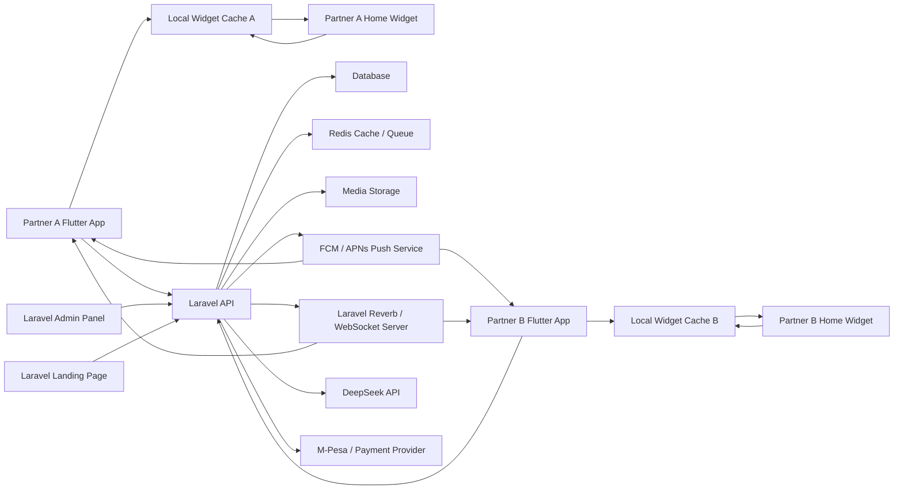
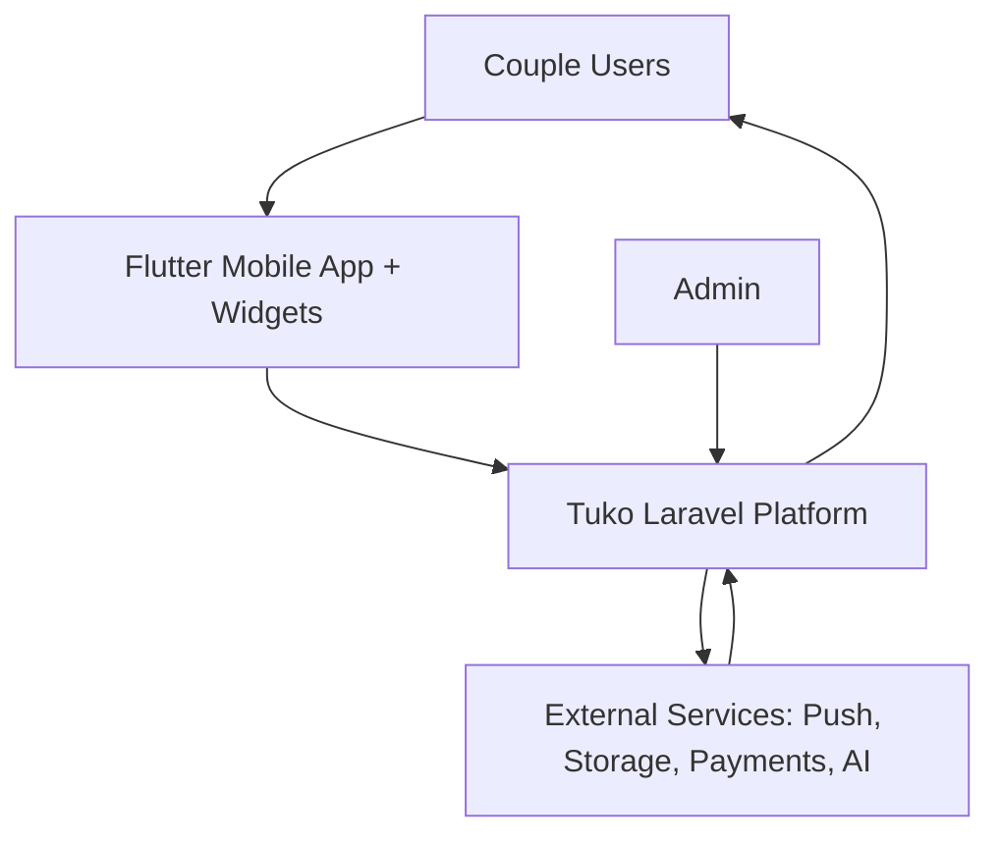
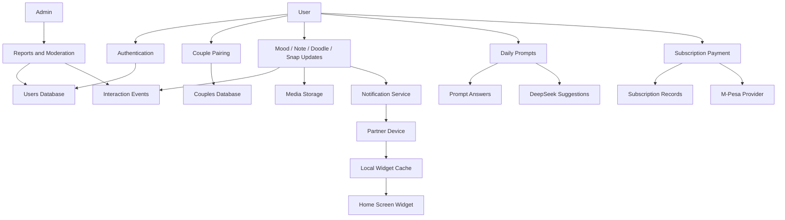
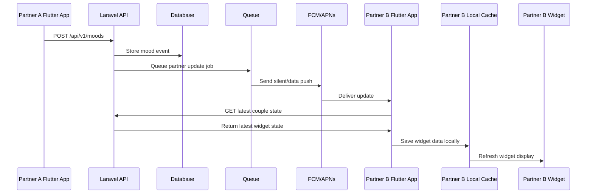
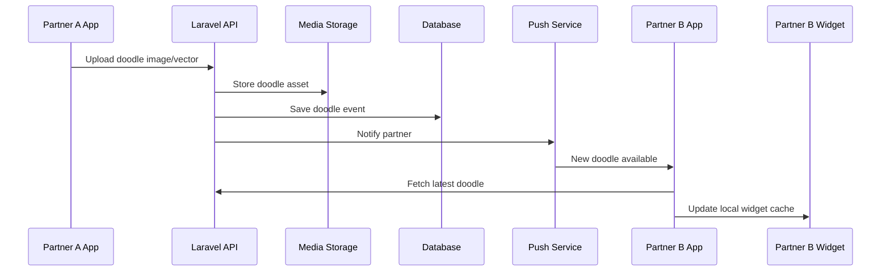

# Tuko / Connect Couples Widget App - Project Blueprint

## 1. Project Overview

### Product Idea
This project is a widget-first couples app for Kenya. The main experience is not the app dashboard. The main experience is the phone home screen widget that helps couples feel close throughout the day through mood updates, notes, doodles, snaps, distance, countdowns, and daily prompts.

The app is for couples who are already together. It is not a dating app.

### Recommended Working Name
Use one of these during development:

- **Tuko**: short, Kenyan, means "we are here".
- **Pamoja**: means "together".
- **Connect**: simple and clear, but less unique.

This document will use **Tuko** as the project name.

### Target Users
- Couples in Kenya.
- Long-distance couples separated by work, school, or travel.
- Couples who want light emotional connection without constant chatting.
- Users who like phone personalization and widgets.

### Core Promise
"See your partner on your home screen, even when the app is closed."

## 2. Core Product Principle

The widget is the primary product surface.

The mobile app exists for:

- Account creation and login.
- Partner pairing.
- Widget setup.
- Sending richer actions like doodles, photos, notes, and prompt replies.
- Viewing history, memories, streaks, and premium features.

The app should not need to stay open all the time.

Widgets cannot reliably maintain a permanent WebSocket connection on Android or iOS. The correct architecture is:

- App sends updates to Laravel API.
- Laravel stores the update.
- Laravel sends push notifications or silent/background updates.
- Flutter app receives the update where supported.
- Home screen widget refreshes from locally cached data.

Real-time in the app can use WebSockets. Widgets should use push/background refresh plus local storage.

## 3. Tech Stack

### Backend, API, Landing Page
Use **Laravel**.

Recommended Laravel modules:

- Laravel 11 or latest stable.
- Laravel Sanctum for mobile API authentication.
- Laravel Reverb or Pusher-compatible WebSockets for live in-app events.
- Laravel Queues for notifications, AI generation, media processing, and reminders.
- Laravel Scheduler for daily prompts, streak checks, and subscription jobs.
- Laravel Cashier or a custom M-Pesa subscription flow depending on payment provider.
- MySQL or PostgreSQL for primary database.
- Redis for queues, cache, sessions, rate limiting, and WebSocket scaling.
- S3-compatible storage for photos, doodle images, and scrapbook media.

### Mobile App
Use **Flutter**.

Recommended Flutter modules:

- Flutter mobile app for Android first, then iOS.
- `home_widget` or native platform channels for Android/iOS widget integration.
- `firebase_messaging` for push notifications.
- `shared_preferences`, SQLite, or Hive for widget-readable local cache.
- `dio` for API requests.
- `riverpod`, `bloc`, or `provider` for state management.
- Native Android widget code may be needed for reliable widget behavior.

### Admin Panel
Use Laravel.

Options:

- Laravel Blade + Tailwind for a simple admin.
- Filament Admin for faster internal dashboards.

### Landing Page
Use Laravel Blade.

Landing page sections:

- Hero: "Your partner, on your home screen."
- How widgets work.
- Features.
- Kenya-specific positioning.
- Pricing.
- Waitlist/download CTA.
- FAQ.
- Privacy and safety.

## 4. System Architecture



### Architecture Explanation

Laravel is the central backend. Flutter apps communicate with Laravel through REST APIs. WebSockets are used only when the app is open for live in-app updates. Push notifications and local cache are used to refresh widgets when the app is closed.

The widget reads from local device storage, not directly from Laravel. This makes the widget fast, battery-friendly, and compatible with mobile OS restrictions.

## 5. Main Features

### MVP Features

1. User registration and login.
2. Couple pairing by invite link or phone number.
3. Home screen mood widget.
4. Home screen note widget.
5. Home screen countdown widget.
6. Basic distance widget using approximate location.
7. Push notification updates.
8. Flutter app screen for sending mood, note, and countdown updates.
9. Laravel landing page.
10. Admin dashboard for users, couples, reports, and basic metrics.

### Phase 2 Features

1. Doodle widget.
2. Photo snap widget.
3. Daily prompts in English and Swahili.
4. Streak system.
5. Memory scrapbook.
6. Premium subscription.
7. Relationship insights.

### Phase 3 Features

1. AI-powered smart suggestions using DeepSeek.
2. Personalized prompts.
3. Sentiment-based check-ins.
4. Theme store.
5. Social sharing of safe/non-private moments.
6. Full Swahili localization.

## 6. Widget Behavior Design

### Mood Widget
Partner selects a mood in the app or quick action.

Example states:

- Happy
- Stressed
- Excited
- Tired
- Missing you

Flow:

1. Partner A selects mood.
2. Flutter sends mood update to Laravel.
3. Laravel stores mood event.
4. Laravel sends push update to Partner B.
5. Partner B app receives update and saves it to local widget cache.
6. Partner B widget refreshes.

### Note Widget
Partner sends a preset or custom note.

Examples:

- Thinking of you.
- Umenimiss?
- Love you.
- Hope your day is going well.

### Doodle Widget
Partner draws a simple doodle in the app.

Important design decision:

The widget should display the latest doodle. The actual drawing happens inside the app or a quick composer, because most home screen widgets cannot support rich freehand drawing directly.

### Photo Snap Widget
Partner sends a quick photo.

The widget displays the latest safe preview. The full image opens in the app.

### Distance Widget
Shows approximate distance only.

Example:

- 12 km apart.
- Nearby.
- In the same town.

Avoid exact live tracking unless both users explicitly opt in.

### Countdown Widget
Shows next date, anniversary, wedding, visit, or planned event.

Example:

- 3 days to date night.

## 7. Data Flow Diagrams

### Level 0 DFD



### Level 1 DFD



### Mood Update DFD



### Doodle Update DFD



## 8. Database Design

### users

- id
- name
- phone
- email
- password
- gender optional
- avatar_url
- language
- country
- timezone
- last_seen_at
- created_at
- updated_at

### couples

- id
- partner_one_id
- partner_two_id
- status: pending, active, blocked, ended
- paired_at
- invite_code
- anniversary_date optional
- created_at
- updated_at

### couple_invites

- id
- inviter_id
- invitee_phone
- invite_code
- status
- expires_at
- accepted_at
- created_at
- updated_at

### widget_states

- id
- couple_id
- user_id
- partner_id
- latest_mood_id
- latest_note_id
- latest_doodle_id
- latest_snap_id
- latest_countdown_id
- latest_distance_id
- version
- updated_at

### mood_events

- id
- couple_id
- sender_id
- receiver_id
- mood_key
- mood_label
- emoji
- message optional
- created_at

### note_events

- id
- couple_id
- sender_id
- receiver_id
- body
- preset_key optional
- created_at

### doodle_events

- id
- couple_id
- sender_id
- receiver_id
- storage_path
- vector_json optional
- thumbnail_path
- created_at

### snap_events

- id
- couple_id
- sender_id
- receiver_id
- image_path
- thumbnail_path
- caption optional
- expires_at optional
- created_at

### distance_events

- id
- couple_id
- user_id
- partner_id
- approximate_distance_km
- location_precision
- created_at

### countdowns

- id
- couple_id
- title
- event_date
- created_by
- is_active
- created_at
- updated_at

### prompts

- id
- category
- language
- question
- is_active
- created_at
- updated_at

### prompt_answers

- id
- prompt_id
- couple_id
- user_id
- answer
- sentiment optional
- created_at

### subscriptions

- id
- user_id
- couple_id optional
- plan
- status
- provider
- provider_reference
- started_at
- ends_at
- created_at
- updated_at

### payments

- id
- user_id
- amount
- currency
- provider
- provider_reference
- status
- paid_at
- raw_payload_json
- created_at
- updated_at

### notification_tokens

- id
- user_id
- platform
- token
- device_name
- last_used_at
- created_at
- updated_at

### audit_logs

- id
- actor_id
- action
- entity_type
- entity_id
- metadata_json
- created_at

## 9. API Design

Base path:

```text
/api/v1
```

### Auth

```text
POST /auth/register
POST /auth/login
POST /auth/logout
GET  /me
PUT  /me
```

### Pairing

```text
POST /couple/invite
POST /couple/accept
GET  /couple
DELETE /couple
```

### Widget State

```text
GET /widget-state
POST /widget-state/sync
```

### Mood

```text
POST /moods
GET  /moods/latest
GET  /moods/history
```

### Notes

```text
POST /notes
GET  /notes/latest
GET  /notes/history
```

### Doodles

```text
POST /doodles
GET  /doodles/latest
GET  /doodles/history
```

### Snaps

```text
POST /snaps
GET  /snaps/latest
GET  /snaps/history
```

### Distance

```text
POST /distance
GET  /distance/latest
```

### Countdowns

```text
POST /countdowns
GET  /countdowns
PUT  /countdowns/{id}
DELETE /countdowns/{id}
```

### Prompts

```text
GET  /prompts/today
POST /prompts/{id}/answer
GET  /prompts/history
```

### Subscriptions

```text
GET  /plans
POST /subscriptions/start
POST /payments/mpesa/stk-push
POST /payments/mpesa/callback
GET  /subscription
```

### Devices

```text
POST /devices/notification-token
DELETE /devices/notification-token
```

## 10. Laravel Backend Modules

Recommended Laravel structure:

```text
app/
  Http/
    Controllers/Api/V1/
    Controllers/Web/
    Requests/
    Resources/
  Models/
  Services/
    CoupleService.php
    WidgetStateService.php
    NotificationService.php
    PaymentService.php
    PromptService.php
    DeepSeekService.php
  Jobs/
    SendPartnerWidgetUpdate.php
    GenerateDailyPrompt.php
    ProcessSnapUpload.php
    AnalyzePromptAnswer.php
  Events/
    MoodUpdated.php
    NoteSent.php
    DoodleSent.php
  Policies/
  Notifications/
routes/
  api.php
  web.php
  channels.php
database/
  migrations/
  seeders/
resources/
  views/
```

## 11. Flutter App Structure

Recommended Flutter structure:

```text
lib/
  app/
    app.dart
    router.dart
    theme.dart
  core/
    api/
    storage/
    widgets/
    errors/
  features/
    auth/
    pairing/
    home/
    mood/
    notes/
    doodles/
    snaps/
    countdowns/
    prompts/
    subscription/
    settings/
  widget_bridge/
    widget_state_repository.dart
    android_widget_updater.dart
    ios_widget_updater.dart
```

### Flutter Screens

- Splash screen.
- Login/register.
- Phone verification if required.
- Pair with partner.
- Main relationship hub.
- Mood sender.
- Note sender.
- Doodle composer.
- Snap sender.
- Countdown setup.
- Prompt answers.
- Memories.
- Subscription.
- Settings and privacy.

## 12. Widget Implementation Notes

### Android

Android widgets are more flexible and should be the first target.

Implementation options:

- Flutter app writes latest widget data to SharedPreferences.
- Native Android AppWidgetProvider reads the data.
- Widget updates when push notification arrives or user interacts.

### iOS

iOS widgets have stricter limitations.

Implementation options:

- Flutter app writes to App Group shared storage.
- WidgetKit reads from shared storage.
- Timeline refreshes are controlled by iOS.
- Push can request reload, but iOS may throttle updates.

### Practical Widget Rule

Design widgets as "latest state views", not as full live apps.

Good widget actions:

- Tap mood.
- Send love.
- Open quick reply.
- Open doodle composer.
- View latest snap.
- Open countdown.

Avoid expecting:

- Continuous WebSocket in widget.
- Always-running location tracking.
- Full drawing directly inside the widget.
- Guaranteed instant refresh every second.

## 13. Security and Privacy

### Must-Have Rules

- Only paired partners can exchange widget data.
- Users can disconnect from a partner.
- Users can block or report a partner.
- Location must be approximate by default.
- Photos should be private and protected.
- Sensitive AI analysis should be opt-in.
- Store minimal private data.
- Encrypt secrets and API keys.
- Rate-limit messaging endpoints.
- Validate all media uploads.

### Privacy Settings

- Show exact distance: off by default.
- Show battery: optional.
- Share location: opt-in.
- Save mood history: opt-in or clear explanation.
- AI insights: opt-in.
- Snap expiry: configurable.

## 14. Monetization

### Free Plan

- Mood widget.
- Basic note widget.
- Countdown widget.
- Limited daily updates.
- Basic pairing.

### Premium Plan

Suggested pricing:

- KES 100/month.
- KES 250/month for richer bundle.
- KES 1,000/year introductory.

Premium features:

- Unlimited widgets.
- Doodle widget.
- Photo snap widget.
- Memory scrapbook.
- Prompt packs.
- Relationship insights.
- Custom themes.
- AI note suggestions.

## 15. Project Phases

### Phase 0: Planning and Design - 1 to 2 Weeks

Deliverables:

- Final app name.
- Logo direction.
- UI design system.
- Widget mockups.
- Database schema.
- API specification.
- Landing page copy.
- Technical setup plan.

### Phase 1: MVP Backend and Landing Page - 3 to 4 Weeks

Deliverables:

- Laravel project setup.
- Landing page.
- Auth APIs.
- User profile APIs.
- Couple invite and pairing APIs.
- Mood, note, countdown APIs.
- Widget state API.
- Push notification token API.
- Admin dashboard basics.

### Phase 2: Flutter MVP - 4 to 6 Weeks

Deliverables:

- Flutter app setup.
- Auth flow.
- Pairing flow.
- Relationship home screen.
- Mood sender.
- Note sender.
- Countdown setup.
- Android widget MVP.
- Push notification handling.
- Local widget cache.

### Phase 3: Widget Expansion - 4 to 6 Weeks

Deliverables:

- Doodle composer.
- Doodle widget display.
- Photo snap sender.
- Snap widget display.
- Distance widget.
- Better widget themes.
- Widget quick actions.

### Phase 4: Engagement Features - 4 Weeks

Deliverables:

- Daily prompts.
- English and Swahili prompt content.
- Prompt answers.
- Streaks.
- Memory scrapbook.
- Relationship activity timeline.

### Phase 5: Payments and Premium - 3 to 5 Weeks

Deliverables:

- Subscription plans.
- M-Pesa integration.
- Payment callbacks.
- Premium feature gates.
- Invoices/payment history.
- Admin subscription controls.

### Phase 6: AI Features - 3 to 4 Weeks

Deliverables:

- DeepSeek API integration.
- Smart mood suggestions.
- Personalized prompts.
- Auto love-note suggestions.
- Relationship insights.
- AI privacy controls.

### Phase 7: Beta Launch - 2 to 4 Weeks

Deliverables:

- Closed beta.
- Crash reporting.
- Analytics.
- Feedback collection.
- Performance tuning.
- Security review.
- Play Store preparation.

## 16. MVP Scope

Build this first:

- Laravel landing page.
- Laravel API.
- Flutter Android app.
- User auth.
- Couple pairing.
- Mood updates.
- Note updates.
- Countdown.
- Basic widget state.
- Android home screen widget.
- Push notification update flow.
- Admin dashboard.

Do not build first:

- Full AI engine.
- iOS widget.
- Complex scrapbook.
- Social sharing.
- Many themes.
- Exact live location.

## 17. Analytics and Success Metrics

Track:

- Registrations.
- Invite sent.
- Invite accepted.
- Pair rate.
- Daily active couples.
- Widget update count.
- Mood sends per couple.
- Note sends per couple.
- Widget refresh success.
- 7-day retention.
- 30-day retention.
- Premium conversion.
- Churn.

Key MVP success metric:

```text
How many paired couples use the widget at least once per day?
```

## 18. Testing Plan

### Backend Tests

- Auth tests.
- Pairing tests.
- Authorization tests.
- Widget state tests.
- Mood/note/countdown API tests.
- Payment callback tests.
- Push job tests.

### Flutter Tests

- Auth flow tests.
- Pairing flow tests.
- API repository tests.
- Widget cache tests.
- State management tests.

### Manual QA

- Install app.
- Pair two test users.
- Add widget.
- Send mood.
- Confirm partner widget updates.
- Send note.
- Confirm notification and widget refresh.
- Disable internet and retry.
- Reboot phone and confirm widget still shows latest state.

## 19. Risks and Solutions

### Risk: Widgets Cannot Be Fully Live

Solution:

Use push notifications, background refresh, and local cache. Use WebSockets only inside the open app.

### Risk: Battery Drain

Solution:

Avoid permanent background services. Use event-driven updates.

### Risk: Privacy Concerns Around Distance

Solution:

Use approximate distance and opt-in controls.

### Risk: Partner Harassment or Misuse

Solution:

Add block, disconnect, report, rate limits, and quiet hours.

### Risk: iOS Widget Restrictions

Solution:

Launch Android first. Add iOS after the product behavior is proven.

### Risk: Payment Complexity

Solution:

Start with simple premium flags. Add M-Pesa after MVP engagement is validated.

## 20. Team Requirements

Minimum team:

- 1 Laravel backend developer.
- 1 Flutter developer.
- 1 UI/UX designer.
- 1 QA tester part-time.

Optional:

- Product manager.
- Copywriter/localization support.
- DevOps engineer.

## 21. Infrastructure

Recommended setup:

- Laravel app server.
- MySQL/PostgreSQL managed database.
- Redis.
- Queue worker.
- Scheduler.
- Object storage.
- Firebase project for FCM.
- Sentry or Bugsnag for error tracking.
- Analytics platform.

Production requirements:

- HTTPS.
- Backups.
- Queue monitoring.
- Log monitoring.
- Rate limiting.
- Separate staging environment.

## 22. Launch Checklist

- Final name and branding selected.
- Landing page live.
- Privacy policy written.
- Terms of service written.
- App permissions reviewed.
- Push notifications tested.
- Widget refresh tested on multiple Android devices.
- Pairing tested.
- Block/disconnect tested.
- Admin dashboard protected.
- Payment flow tested if premium is launched.
- Play Store assets prepared.
- Beta testers invited.

## 23. Suggested First Build Order

1. Laravel project setup.
2. Database migrations.
3. Auth API.
4. Couple pairing.
5. Mood API.
6. Note API.
7. Widget state API.
8. Push notification token API.
9. Flutter auth and pairing.
10. Flutter mood and note screens.
11. Android widget local cache.
12. Push-triggered widget refresh.
13. Landing page.
14. Admin dashboard.

## 24. Final Product Direction

The strongest version of this product is not a relationship dashboard that users must open every time.

The strongest version is:

```text
A private couple widget system that keeps your partner present on your home screen.
```

The app is for setup and deeper actions. The widget is the daily habit.

