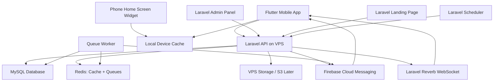
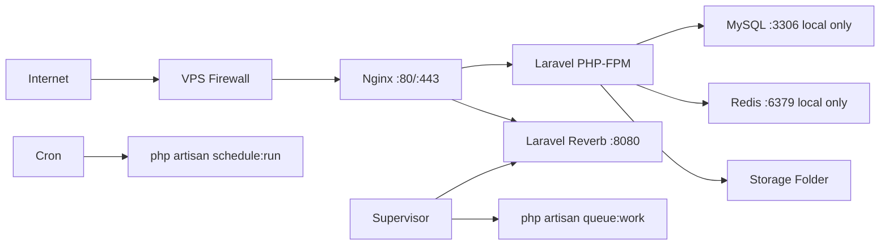
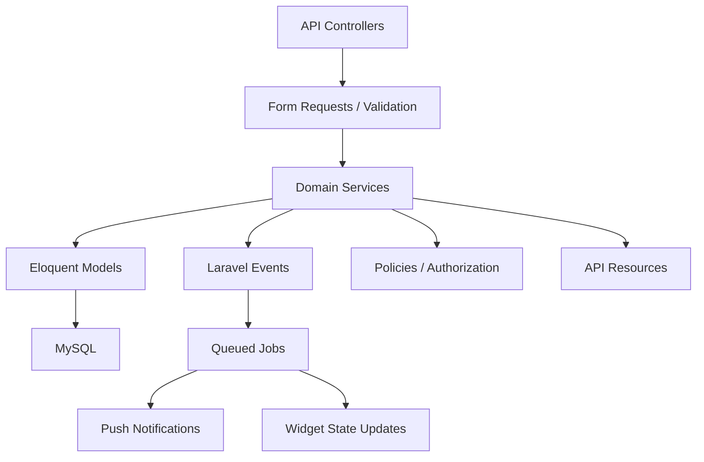
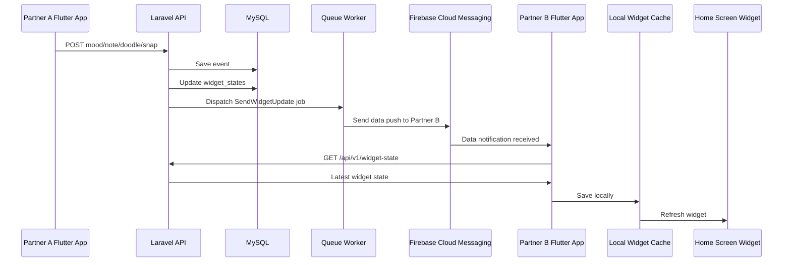
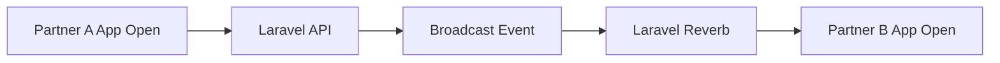
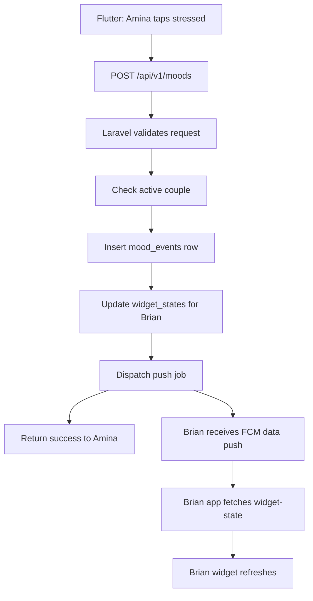

# Tuko / Connect System Design - VPS + MySQL

## 1. Goal

Build a widget-first couples app using:

- **Laravel** for landing page, backend, admin panel, and API.
- **Flutter** for Android/iOS mobile app.
- **MySQL** as the main database.
- **VPS** as the hosting environment.

The system must support:

- User accounts.
- Couple pairing.
- Widget state updates.
- Mood, notes, countdowns, doodles, snaps, distance updates.
- Push notifications.
- Admin management.
- Future payments and AI features.

## 2. High-Level System Design



## 3. VPS Architecture

### Recommended VPS Setup

For MVP:

- Ubuntu 22.04 or 24.04 LTS.
- 2 vCPU minimum.
- 4 GB RAM minimum.
- 80 GB SSD minimum.
- MySQL 8.
- PHP 8.3.
- Nginx.
- Redis.
- Supervisor.
- Certbot SSL.

For beta/production:

- 4 vCPU.
- 8 GB RAM.
- 160 GB SSD.
- Automated backups.
- Separate storage bucket for media if possible.

## 4. Server Components

### Nginx

Responsibilities:

- Serve Laravel landing page.
- Reverse proxy API requests to PHP-FPM.
- Terminate HTTPS.
- Serve public assets.
- Proxy WebSocket traffic to Laravel Reverb.

### PHP-FPM

Runs Laravel HTTP requests:

- Landing page.
- API.
- Admin panel.
- Payment callbacks.

### MySQL

Primary persistent data store:

- Users.
- Couples.
- Widget states.
- Mood events.
- Notes.
- Doodles metadata.
- Snaps metadata.
- Countdowns.
- Payments.
- Subscriptions.
- Admin data.

### Redis

Used for:

- Queues.
- Cache.
- Rate limiting.
- Laravel Reverb scaling later.

### Supervisor

Keeps background processes alive:

- Laravel queue workers.
- Laravel Reverb WebSocket server.

### Laravel Scheduler

Runs every minute through cron:

- Daily prompts.
- Streak checks.
- Expired invite cleanup.
- Subscription checks.
- Media cleanup.

## 5. Deployment Topology



### Ports

Expose publicly:

- `80` HTTP for redirect to HTTPS.
- `443` HTTPS.

Keep private/local:

- `3306` MySQL.
- `6379` Redis.
- `9000` PHP-FPM.
- `8080` Reverb, proxied through Nginx.

## 6. Application Architecture



### Laravel Layers

Use this structure:

```text
app/
  Http/
    Controllers/
      Api/V1/
      Web/
      Admin/
    Requests/
    Resources/
  Models/
  Services/
  Jobs/
  Events/
  Notifications/
  Policies/
```

### Important Services

- `AuthService`
- `CoupleService`
- `WidgetStateService`
- `MoodService`
- `NoteService`
- `DoodleService`
- `SnapService`
- `DistanceService`
- `CountdownService`
- `NotificationService`
- `SubscriptionService`
- `DeepSeekService` later

## 7. Widget Update Design

The widget should not depend on the app always being open.

Correct flow:



### Why This Works

- Widgets read from local device cache.
- Laravel is the source of truth.
- Push wakes the app when allowed.
- WebSockets are used only when the app is open.
- The app does not need to run forever in the background.

## 8. Realtime Design

### Use WebSockets For

- Open app live updates.
- Partner online presence.
- Live doodle preview while both users are inside the app.
- In-app activity feed updates.

### Do Not Use WebSockets For

- Permanent widget sync.
- Always-running background location.
- Keeping the app open forever.

### Recommended Tool

Use **Laravel Reverb** on the VPS.

Flow:



## 9. MySQL Database Design

### Core Tables

```text
users
couples
couple_invites
widget_states
mood_events
note_events
doodle_events
snap_events
distance_events
countdowns
notification_tokens
subscriptions
payments
prompts
prompt_answers
audit_logs
```

### Recommended Indexes

```text
users
- unique phone
- unique email nullable

couples
- index partner_one_id
- index partner_two_id
- index status

couple_invites
- unique invite_code
- index inviter_id
- index invitee_phone
- index status

widget_states
- unique couple_id + user_id
- index partner_id
- index updated_at

mood_events
- index couple_id + created_at
- index sender_id + created_at
- index receiver_id + created_at

note_events
- index couple_id + created_at
- index receiver_id + created_at

doodle_events
- index couple_id + created_at

snap_events
- index couple_id + created_at
- index expires_at

distance_events
- index couple_id + created_at

countdowns
- index couple_id
- index event_date
- index is_active

notification_tokens
- unique token
- index user_id

payments
- index user_id
- index provider_reference
- index status

subscriptions
- index user_id
- index status
- index ends_at
```

## 10. Widget State Table

The `widget_states` table is important because widgets need the latest state quickly.

Instead of querying many history tables every time, maintain one latest-state row per user/couple.

Example:

```text
id
couple_id
user_id
partner_id
latest_mood_event_id
latest_note_event_id
latest_doodle_event_id
latest_snap_event_id
latest_distance_event_id
active_countdown_id
version
updated_at
```

When Partner A sends a note:

1. Insert into `note_events`.
2. Update Partner B's `widget_states.latest_note_event_id`.
3. Increment `widget_states.version`.
4. Send push to Partner B.

The Flutter app can compare versions:

```text
local widget version < server widget version
```

Then it updates the local widget cache.

## 11. API System Design

### API Pattern

Use REST API first.

Base URL:

```text
https://yourdomain.com/api/v1
```

Authentication:

- Laravel Sanctum token auth.

Response format:

```json
{
  "success": true,
  "message": "Mood sent",
  "data": {}
}
```

Error format:

```json
{
  "success": false,
  "message": "Validation failed",
  "errors": {}
}
```

### Main API Groups

```text
/auth
/me
/couple
/widget-state
/moods
/notes
/doodles
/snaps
/distance
/countdowns
/prompts
/subscriptions
/payments
/devices
```

## 12. File and Media Storage

### MVP on VPS

Store files in:

```text
storage/app/public/
```

Use:

```text
php artisan storage:link
```

Store:

- Doodle PNG thumbnails.
- Snap images.
- User avatars.

### Production Recommendation

Move media to S3-compatible storage later:

- AWS S3.
- DigitalOcean Spaces.
- Wasabi.
- Cloudflare R2.

Reason:

- Easier backups.
- Less VPS disk pressure.
- Better media delivery.

## 13. Push Notification Design

Use Firebase Cloud Messaging for Android.

For iOS later:

- FCM can still be used as the client integration.
- Apple Push Notification Service is used underneath.

### Push Types

Visible notification:

- "Amina sent you a note."
- "Brian updated his mood."

Data/silent push:

- Tells app to fetch latest widget state.
- Used for widget refresh.

### Push Payload Example

```json
{
  "type": "widget_update",
  "couple_id": 12,
  "widget_version": 45,
  "event_type": "mood"
}
```

## 14. Security Design

### Authentication

- Laravel Sanctum token auth.
- Store tokens securely on Flutter using secure storage.
- Revoke tokens on logout.

### Authorization

Every couple endpoint must confirm:

- User is authenticated.
- User belongs to the couple.
- Couple status is active.

### Location Privacy

Default:

- Approximate distance only.
- No exact map.
- No continuous tracking.

### Media Security

- Validate file type.
- Limit file size.
- Strip metadata where possible.
- Use private storage or signed URLs for sensitive media.

### Abuse Controls

- Block partner.
- Disconnect partner.
- Report user.
- Rate-limit notes and snaps.
- Quiet hours.

## 15. VPS Security Checklist

- Enable UFW firewall.
- Allow only `22`, `80`, `443`.
- Use SSH keys, not password login.
- Disable root SSH login.
- Install SSL with Certbot.
- Keep MySQL bound to localhost.
- Keep Redis bound to localhost.
- Use strong database passwords.
- Set correct Laravel `.env` permissions.
- Run Laravel as non-root user.
- Enable automatic security updates.
- Add fail2ban if possible.

## 16. Queue Design

Use Laravel queues with Redis.

Queue jobs:

- Send push notification.
- Process image upload.
- Generate doodle thumbnail.
- Update widget state.
- Analyze prompt response later.
- Send daily prompt.
- Process payment callback.

Supervisor process:

```text
php artisan queue:work redis --sleep=3 --tries=3 --timeout=90
```

## 17. Scheduler Design

Cron entry:

```text
* * * * * cd /var/www/tuko && php artisan schedule:run >> /dev/null 2>&1
```

Scheduled tasks:

- Send daily prompts.
- Check streaks.
- Expire old invites.
- Clear expired snaps.
- Check subscription expiry.
- Run backup job.

## 18. Backup Design

### MySQL Backups

Minimum:

- Daily database dump.
- Keep 7 daily backups.
- Keep 4 weekly backups.
- Store a copy outside the VPS.

Example storage:

- VPS local backup folder.
- External object storage.
- Another server.

### Media Backups

Back up:

- `storage/app/public`
- `.env` separately and securely.

Do not store `.env` in Git.

## 19. Scaling Plan

### Stage 1: Single VPS

Everything on one VPS:

- Nginx.
- Laravel.
- MySQL.
- Redis.
- Queue workers.
- Reverb.

Good for MVP and early beta.

### Stage 2: Bigger VPS

Upgrade CPU/RAM/storage when usage grows.

### Stage 3: Split Database

Move MySQL to managed database or separate VPS.

### Stage 4: Split Workers

Run queue workers on separate VPS.

### Stage 5: Move Media

Move snaps/doodles/avatars to object storage.

### Stage 6: Load Balanced App Servers

Use multiple Laravel app servers behind a load balancer.

## 20. MVP Deployment Layout

Recommended folder:

```text
/var/www/tuko
```

Important commands:

```text
composer install --no-dev --optimize-autoloader
php artisan migrate --force
php artisan config:cache
php artisan route:cache
php artisan view:cache
php artisan storage:link
php artisan queue:restart
```

## 21. Environment Variables

Important `.env` values:

```text
APP_ENV=production
APP_DEBUG=false
APP_URL=https://yourdomain.com

DB_CONNECTION=mysql
DB_HOST=127.0.0.1
DB_PORT=3306
DB_DATABASE=tuko
DB_USERNAME=tuko_user
DB_PASSWORD=strong_password

CACHE_STORE=redis
QUEUE_CONNECTION=redis
SESSION_DRIVER=redis

REDIS_HOST=127.0.0.1
REDIS_PASSWORD=null
REDIS_PORT=6379

BROADCAST_CONNECTION=reverb

FCM_SERVER_KEY=
DEEPSEEK_API_KEY=
MPESA_CONSUMER_KEY=
MPESA_CONSUMER_SECRET=
```

## 22. MVP Request Flow

### Send Mood



## 23. Recommended MVP Build Order

1. Set up Laravel project.
2. Configure MySQL.
3. Add Sanctum auth.
4. Build users and profiles.
5. Build couple invites and pairing.
6. Build widget state table.
7. Build mood events.
8. Build note events.
9. Build countdowns.
10. Add FCM device tokens.
11. Add push notification job.
12. Build Flutter auth.
13. Build Flutter pairing.
14. Build Flutter mood and note sending.
15. Build Android widget cache.
16. Build Android widget display.
17. Connect FCM to widget refresh.
18. Build landing page.
19. Build admin dashboard.

## 24. Final Recommendation

For your VPS + MySQL setup, start with a single-server Laravel deployment:

```text
Nginx + PHP-FPM + Laravel + MySQL + Redis + Supervisor + Reverb
```

Use MySQL as the source of truth, Redis for queues/cache, Firebase for widget update notifications, and local Flutter/widget cache for home screen display.

This gives you the right MVP architecture without pretending the mobile app can stay open forever.

